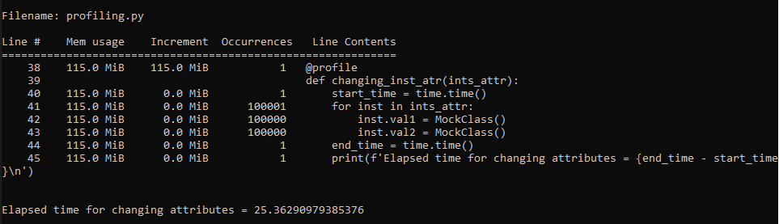

### 1. Сравнение использования weakref и слотов
---

Результат работы программы:

Таким образом, в данном случае занятое время для создания объектов (100000 объектов):

- с обычными атрибутами - 0.17188

- со слотами - 0.16193

- со слабыми ссылками - 0.25875

Для изменения объектов было затрачено следующее время:

- с обычными атрибутами - 0.03167

- со слотами - 0.02879

- со слабыми ссылками - 0.02666

По этим результатам можно сделать следующие выводы:

**Время создания объектов со слотами занимает меньше всего времени, поскольку
они обеспечивают специальный механизм уменьшения размера объектов. Не создается
dict у объектов. Таким образом мы экономим время на создании словаря и вставки
в него значений.**

**Больше всего занимает времени создании объектов со слабыми ссылками, поскольку
в объекте создается атрибут __weakref__, то есть необходимо тратить время еще и на это
, помимо создания __dict__.**

**Время на изменение атрибутов объекта со слабыми ссылками тратится меньше всего
поскольку объкты, на которые удаляются сборщиком мусора никак не отражаются на
слабых ссылках, они просто возвращают None, то есть операции со слабыми ссылками
проводятся без блокировок и без гарантии существования объекта на протяжении всей операции.**

**Время на изменение атрибутов объекта со слотами занимает чуть больше времени,
поскольку не тратится время на поиск в словаре __dict__, который выполняется за
константу, без учета того, что могу происходить коллизии. То есть поиск осуществляется
в атрибутах объекта, что быстрее.**

### 2. Профилирование
---

Смотрим выделение памяти для обычных атрибутов:

Видим, что выделилось 25.7 MiB памяти, тут все нормально, создается словарь __dict__, иногда ему нужно увеличиваться в размерах, в него кладутся все атрибуты.

Выделение памяти для класса со слотами:

Тут памяти выделилось меньше - всего 14.7 Mib, словарь __dict__ не создается, память экономится.

Выделение памяти для класса со слабыми ссылками:

Происходят дополнительные затраты для создания атрибутов __weakref__

Изменение атрибутов у всех классов не используют память:

