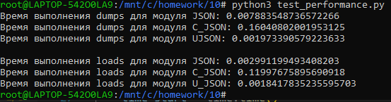

### 1. Выводы по производительности библиотек
---

Результат работы программы:

Таким образом, в данном случае занятое время для dumps со 10000 элементов в словаре:

- для json - 0.00788

- для cjson - 0.16040

- для ujson - 0.00197

Для loads строки со 10000 элементами было затрачено следующее время:

- для json - 0.00299

- для cjson - 0.11997

- для ujson - 0.00184

По этим результатам можно сделать следующие выводы:

**Время работы самописной библиотеки cjson на порядки больше чем для
библиотек json и ujson. При дальнейшем увеличении количества элементов
время выполнения методов loads и dumps у cjson улетает очень быстро.
Это происходит из-за того, что библиотека написана не оптимальным образом,
не учитывая временную и пространственную сложности алгоритмов. Время 
выполнения методов библиотек json и ujson значительно меньше, поскольку
они сами написаны на языке С с хорошой оптимизацией, проверенной временем.**
